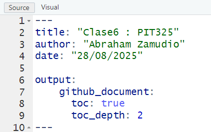

```{r setup, include=FALSE}
knitr::opts_chunk$set(echo = TRUE)
```

# Como crear un indice (tabla de contenidos) 

Debes cambiar el yaml, que es la sección superior del código entre los conjuntos de 3 guiones

De forma predeterminada, cuando abres un nuevo Rmarkdown, el yaml se ve así...


## Esto se puede cambiar de muchisimas maneras, solamente una de ellas
se ve asi : 



## La estructura YAML

> ¡CUIDADO, la sangría importa!

La estructura YAML en RMarkdown es el encabezado de metadatos ubicado al inicio del documento, delimitado por tres guiones (---) al principio y al final. Se compone de pares clave-valor (ej. title: "Clase6 : PIT325") que definen información como el título, autor, fecha, y, crucialmente, el formato de salida del documento (como github_document). La sangría es fundamental en YAML, ya que define la jerarquía de los campos, y no se deben usar tabuladores, sino espacios. 


